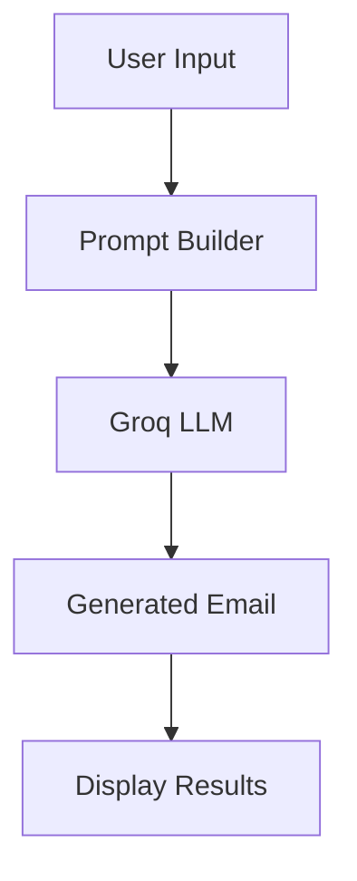

# MailCraft AI — Intelligent Email Assistant

MailCraft AI is a portfolio-ready Streamlit application that uses Generative AI to draft, rewrite, review, and personalize emails. Generative AI uses large language models (LLMs) trained to predict useful next words from context. Here, structured prompts give the LLM an email's purpose, audience, tone, and constraints so it can create a relevant draft.

Prompt engineering is the practice of giving a model clear instructions and context. MailCraft's prompts specify output format, request realistic subject lines, preserve user-provided facts, and explicitly prohibit invented details and repetition.

## Features

- Generate emails by purpose, recipient, tone, length, and custom context
- Rewrite emails in seven styles, including grammar correction and clarity improvement
- Grammar checker with corrections, professional suggestions, improved version, tone, and readability feedback
- Ten customizable templates: internship request, cold email, referral, thank-you, interview follow-up, resignation, meeting, networking, offer acceptance, and offer rejection
- Session history with copy, delete, and TXT download actions
- Primary Groq model with an automatic free-model fallback and friendly error handling

## Tech Stack

| Component | Technology |
| --- | --- |
| Frontend | Streamlit |
| Backend | Python |
| LLM API | Groq (free tier) |
| LLM framework | LangChain / langchain-groq |
| Models | llama-3.3-70b-versatile, llama-3.1-8b-instant fallback |

## Application Workflow

User Input → Prompt Engineering → Groq LLM → Generated Email → User Review → Download/Copy

## System Architecture



## Folder Structure

```text
MailCraft AI/
├── app.py          # Streamlit UI and session history
├── prompts.py      # Prompt construction
├── services.py     # LangChain + Groq calls
├── templates.py    # Built-in email templates
├── utils.py        # Validation and UI helpers
├── requirements.txt
└── .env.example
```

## Installation

1. Install Python 3.10+.
2. Create and activate a virtual environment.
3. Run `pip install -r requirements.txt`.
4. Copy `.env.example` to `.env`, then add a free `GROQ_API_KEY` from [Groq Console](https://console.groq.com/keys).

## Running

```bash
streamlit run app.py
```

## Screenshots

### Home
Add a screenshot of the feature-card home screen here.

### Generate Email
Add a screenshot of the generation form and result here.

### Rewrite Email
Add a screenshot of the rewrite workflow here.

### Grammar Checker
Add a screenshot of the grammar report here.

### Templates
Add a screenshot of template customization here.

## Example Prompts

- “Mention my machine-learning internship, Python skills, and availability from June to August.”
- “Ask my professor for a 20-minute meeting next week to discuss my capstone project.”
- “Thank the recruiter after a data analyst interview and reference our discussion of dashboards.”

## Challenges

- Designing prompts that preserve facts while maintaining a professional tone
- Avoiding repetitive phrasing across different writing styles
- Handling provider, network, API-key, and rate-limit failures gracefully
- Keeping outputs useful for very different audiences and email purposes

## Future Improvements

- Voice input and multiple languages
- Outlook, Gmail, and calendar integration
- PDF export and cloud deployment

## Resume Description

- Developed an LLM-powered intelligent email assistant using Groq and LangChain capable of generating, rewriting, and improving professional emails through structured prompt engineering and customizable writing styles.
- Built a polished Streamlit interface with reusable Python modules, email templates, session history, TXT exports, and graceful API error handling.
